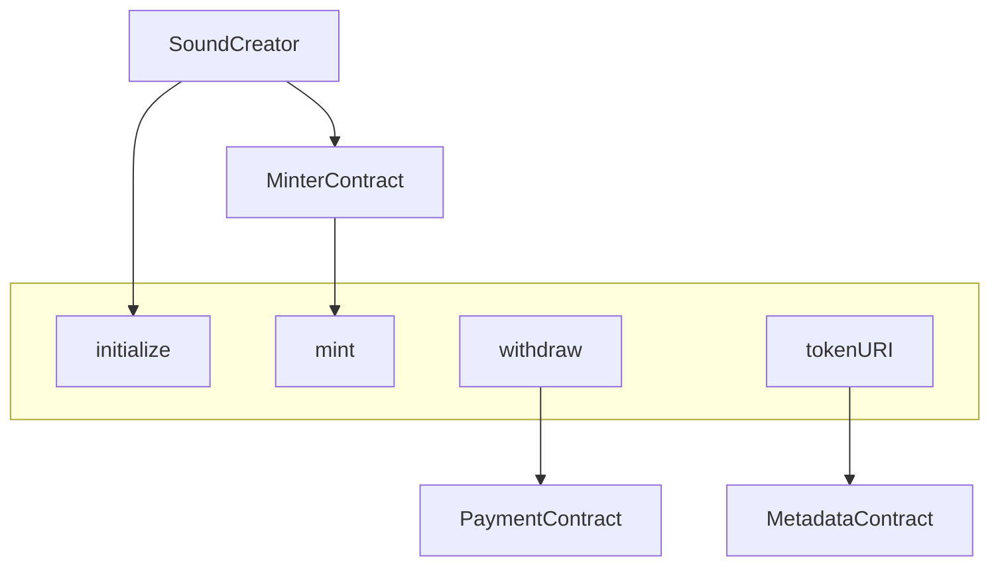

# Sound Protocol

Sound Protocol is a generalized platform for flexible and efficient creation of NFT drops.

## Deployments

Deployed on goerli & mainnet:

| Contract  |  Address |
|---|---|
| `SoundFeeRegistry` | 0x8f921211c9771baeb648ac7becb322a540298a4b |
| `GoldenEggMetadata` | 0x3ca50e8da8c3d359fc934aea0161f5346ccb62a1
| `FixedPriceSignatureMinter` | 0xc47306699611fc4c84744dcd7f458938b829506a
| `MerkleDropMinter` | 0xeae422887230c0ffb91fd8f708f5fdd354c92f2f
| `RangeEditionMinter` | 0x65c25fadd9b88df5c8c101a3b99a5d614b708596
| `EditionMaxMinter` | 0xb1e015816c823f556d1eb921042bb09ed41db8a7
| `SoundEditionV1` | 0x8cfbfae570d673864cd61e1e4543eb7874ca35c2
| `SoundCreatorV1` | 0xaef3e8c8723d9c31863be8de54df2668ef7c4b89

## Specification

See [spec](./spec.md) for current protocol specification. For details on how to build and run a custom minter instance, see section ["Adding a custom minter module"](./spec.md#adding-a-custom-minter-module) section in spec. Documentation coming soon.

## Architecture

The Sound Protocol comprises of several components: 

- **`SoundEdition`**  

  The NFT contract.

  An [ERC721A](https://github.com/chiru-labs/ERC721A) contract deployed via the [minimal proxy clone](https://eips.ethereum.org/EIPS/eip-1167) pattern.

  The `mint` function allows authorized minter contracts or administrators to batch mint NFTs  
  (authorization is granted via the `MINTER_ROLE` or `ADMIN_ROLE`).

- **`SoundCreator`** 

  A factory that allows for a single transaction setup that:
  1. Deploys and initializes `SoundEdition`.
  2. Authorize one or more `MinterContract`s on `SoundEdition`.   
  3. Configure one or more `MinterContract`s to mint on `SoundEdition`. 

- **`MinterContract`**

  A contract to call the `mint` function on `SoundEdition`.  
  This contract can implement any kind of customized sales logic.  
  One or more `MinterContract`s can be used on the `SoundEdition` simultaneously.

- **`MetadataContract`**

  A contract which is called by the `SoundEdition` in the `tokenURI` function for customizable metadata logic.

- **`PaymentContract`**

  Can be a contract such as a [0xSplits](https://github.com/0xSplits/splits-contracts) wallet, or an Externally Owned Account (EOA).
  
## Diagram



## Contracts

The smart contracts are stored under the `contracts` directory.

Files marked with an asterik (*) are specific to [sound.xyz](https://sound.xyz),  
but you can refer to them if you are building contracts to interact with them on-chain,   
or building your own customized versions.

```ml
contracts/
├── core
│   ├── SoundCreatorV1.sol ─ "Factory"
│   ├── SoundEditionV1.sol ─ "NFT implementation"
│   ├── SoundFeeRegistry.sol * ─ "Platform fee registry"
│   ├── interfaces
│   │   ├── IMetadataModule.sol ─ "Metadata module interface"
│   │   ├── IMinterModule.sol * ─ "Generalized minter interface"
│   │   ├── ISoundCreatorV1.sol ─ "Factory interface"
│   │   ├── ISoundEditionV1.sol ─ "NFT implementation interface"
│   │   └── ISoundFeeRegistry.sol * ─ "Platform fee registry interface"
│   └── utils
│       └── ArweaveURILib.sol * ─ "For efficient storage of Arweave URIs"
└── modules
    ├── BaseMinter.sol * ─ "Contains shared minting logic"
    ├── EditionMaxMinter.sol * ─ "Minimalistic minter"
    ├── FixedPriceSignatureMinter.sol * ─ "For permissioned mints via ECDSA signatures"
    ├── MerkleDropMinter.sol * ─ "For permissioned mints via Merkle proofs"
    ├── RangeEditionMinter.sol * ─ "Cuts off mints after a set time if a quota is hit"
    ├── GoldenEggMetadata.sol * ─ "For the on-chain golden egg metadata"
    └── interfaces
        ├── IEditionMaxMinter.sol *
        ├── IFixedPriceSignatureMinter.sol *
        ├── IMerkleDropMinter.sol *
        ├── IRangeEditionMinter.sol *
        └── IGoldenEggMetadata.sol *
```

## Documentation

A comprehensive documentation is currently in the works.

## Installation

### Prerequisites

-   [git](https://git-scm.com/downloads)
-   [nodeJS](https://nodejs.org/en/download/)
-   [node version manager](https://github.com/nvm-sh/nvm)
-   [pnpm](https://pnpm.io/) - You need to have `pnpm` installed globally, you can run `npm i -g pnpm` to install it.
-   [brew](https://brew.sh/)
-   [foundry](https://getfoundry.sh) - You can run `sh ./setup.sh` to install Foundry and its dependencies.

### Setup

-   Clone the repository

    ```bash
    git clone git@github.com:soundxyz/sound-protocol.git
    cd sound-protocol
    ```

-   Setup node version
    Either install the version specified in `nvmrc` or use `nvm` to set it up:

    ```
    nvm use
    ```

-   Install packages

    ```
    pnpm install
    ```

-   Build contracts

    ```
    pnpm build
    ```

-   Run tests

    ```
    pnpm test
    ```

-   Print gas reports from tests

    ```
    pnpm test:gas
    ```

### Code conventions

We generally follow OpenZeppelin's conventions:

-   Underscore `_before` private variables.
-   Underscore `after_` function arguments which shadow globals.
-   [Natspec](https://docs.soliditylang.org/en/develop/natspec-format.html) format for comments, using `@dev` for function descriptions.

### Testing

(`v` == logs verbosity)

`forge test -vvv`

**Code coverage:**

We use [codecov](https://app.codecov.io/gh/soundxyz/sound-protocol/) for analysing the code coverage reports generated by forge coverage. To view code coverage locally, you'll need to install `lcov` (mac: `brew install lcov`) and run:

```
pnpm test:coverage
```

This will produce the coverage report in `/coverage` folder. Note that `forge coverage` is still in active development so it often claims if/else branches are uncovered even when there are tests executed on them.

### Deploying

Create a .env in the root with:

```
GOERLI_RPC_URL=
MAINNET_RPC_URL=
PRIVATE_KEY=
ETHERSCAN_KEY=
OWNER=<address that will own the ownable contracts>
```

Then run:

```
pnpm deploy:goerli

```
